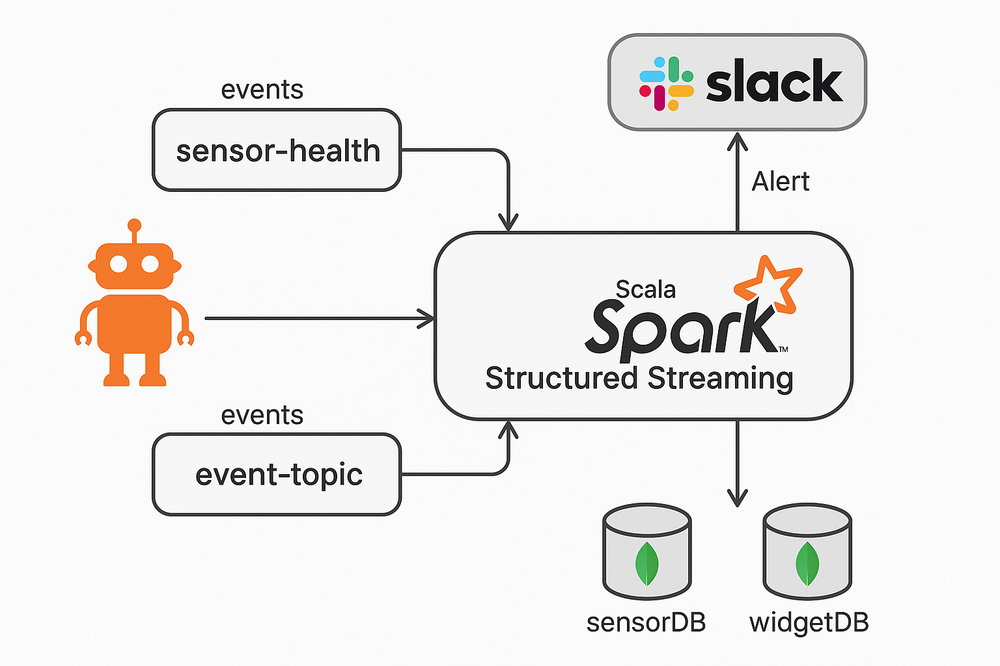

# 📦 Kafka Widget Streaming App

This project demonstrates real-time widget order ingestion via **Apache Kafka**, processing in **Apache Spark**, and visualization through **Akka HTTP API** with storage in **MongoDB**.

---

## 🚀 Quick Start with Docker Compose

```bash
docker-compose up --build
```

This will start the following services:

- **Zookeeper** (2181)
- **Kafka** (9092 internal, 29092 for Kafka clients)
- **MongoDB** (27017)
- **Spark** (runs `KafkaToMongoApp` with `spark-submit`)
- **Widget API** (`WidgetServiceAPI` exposed on `localhost:8080`)
- **Kafdrop UI** (Kafka web UI on [localhost:9000](http://localhost:9000))

---

## 🔧 API Access & Testing

### 1. Exposed Port

Ensure your Docker container exposes the service port:

```dockerfile
EXPOSE 8080
```

And in `docker-compose.yml`:

```yaml
ports:
  - "8080:8080"
```

### 2. Internal Container Test

To test API access from inside the container:

```bash
docker exec -it widget-service bash
curl http://localhost:8080/orders/Fred
```

### 3. Windows Host Access (Outside Docker)

On Windows, use the Docker host gateway:

```powershell
Invoke-RestMethod -Uri http://host.docker.internal:8080/orders/Fred
```

---

## 🧪 Example Kafka Test Message

Send a Kafka event to `event-topic`:

```bash
echo '{ "type":"WidgetOrdered", "customerId":"Fred", "widgetId":"W123" }' | docker exec -i kafka /usr/bin/kafka-console-producer   --broker-list kafka:29092 --topic event-topic
```

Then query with:

```bash
Invoke-RestMethod -Uri http://host.docker.internal:8080/orders/Fred
```

You should see the widget order response if everything is working ✅

---

## 📂 Folder Structure

```
spark-consumer/
├── Dockerfile
├── build.sbt
├── src/main/scala/
│   ├── model/
│   │   ├── Order.scala
│   │   └── JsonProtocol.scala
│   ├── WidgetServiceAPI.scala
│   └── WidgetEventConsumer.scala
```

---

Happy Streaming! ⚡

✅ 해결 방법 (Windows용 Spark 필수 설정)

1. winutils.exe 다운로드
   GitHub에서 Spark 버전과 호환되는 winutils.exe 다운로드:
   👉 https://github.com/steveloughran/winutils

예시:

Spark 3.4.x → Hadoop 3.0.0 winutils 필요

예: C:\winutils\hadoop-3.0.0\bin\winutils.exe 위치에 저장 2. 환경변수 설정
PowerShell 또는 cmd에서:
$env:HADOOP_HOME="C:\winutils\hadoop-3.0.0"
$env:PATH += ";$env:HADOOP_HOME\bin"

### docker에서의  mongodb를  local에서 접속하려면 
mongodb://host.docker.internal:27017
  

docker exec -it kafka /usr/bin/kafka-console-consumer `
  --bootstrap-server kafka:29092 `
  --topic sensor-health `
  --from-beginning

## 🔄 이벤트 기반 아키텍처 (Event-driven Architecture)




