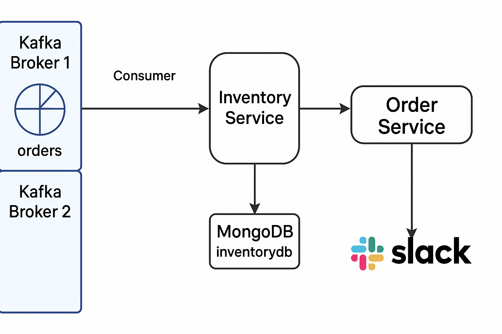

# Kafka Microservices Extended Study

## 🔌 Kafka 열결 전

Kafka를 가르치며 broker 3개, topic 3개를 만들려고 했지만, 전화자원과 CPU, Disk 자원물 당장 불족으로 하루중일이 초기화되지 않았습니다.

- 이용 JVM가 하나씩 회원을 착용해 만들며
- Memory, CPU, Disk I/O 가 건드러지며 대부모 잠시만에 몰라진 상황이 되었습니다.


## 🌐 간장 구조 변경

자원 필요력을 감소하기 위해

- Broker 2개 만 사용
- Topic 1개 생성
- replication-factor 1, partition 1 설정
- JVM Heap Memory를 512MB로 감소 (`-Xms512M -Xmx512M`)

을 적용해 건설했습니다.


## 🌐 Architecture



- **Kafka Broker 1, 2**: 2개 broker 파이프로 구성
- **Order Service**: Kafka Producer 로 orders topic에 메시지전송
- **Inventory Service**: Kafka Consumer로 orders topic 다음 행정을 진행
  - MongoDB(`inventorydb.orders`)에 데이터저장
  - Slack에 메시지 전송
- **MongoDB**: `inventorydb` DB의 `orders` Collection에 저장
- **Slack**: order 개체 정보를 관찰자가 가기적으로 확인


## 📈 개발 중 발생한 문제와 해결

- Slack에서 메시지는 잘 가드리고 있었지만,
- MongoDB에는 데이터가 저장되지 않았습니다.

검사가와는 것은:

- application.yml에 MongoDB URI가
  ```yaml
  mongodb://mongodb:27017/inventorydb
  ```
  가 두지고 있었으므로, 해당 Docker 커뮤터의 파싱 포트를 27018로 바꾼 후:

  ```yaml
  mongodb://mongodb:27018/inventorydb
  ```

- 바꾼 후에 MongoDB와의 연결이 정산되어, Inventory Service가 정산적으로 데이터를 저장할 수 있게 되었습니다.


## 🔄 정보 중에 중요 해외

- **Kafka**: Broker 2개 / Topic 1개 / Replication 1 / Partition 1
- **MongoDB**: 27018 Port / Database `inventorydb` / Collection `orders`
- **Slack**: 할당 webhook URL에 text 개채사이 데이터전송
- **Spring Boot Microservices**: Order Service (전송) <-> Kafka <-> Inventory Service (수신, MongoDB, Slack전송)


---

이 것으로 커뮤니\uud83d�을 개발가능한 가능화 시간을 감소할 수 있게 되었습니다.

## 🛠 Architecture Overview

아래 그림은 2개의 Kafka Broker, MongoDB, Slack, 그리고 Microservices(Order Service, Inventory Service)를 이용하여 구성한 구조를 나타냅니다.


